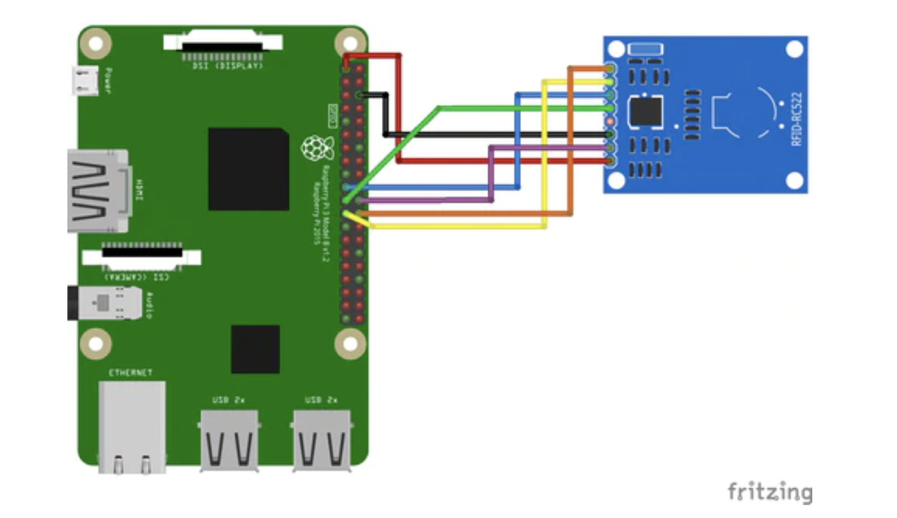
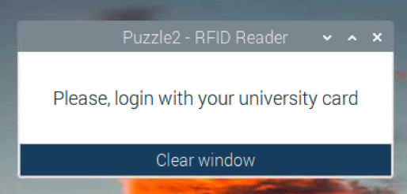

# PBE-rfid-project

Puzzle 1

El primer puzzle consiste en leer el uid de una tarjeta rfid y mostrarlo por pantalla.

1. Montaje del receptor RFID




2. Habilitar SPI en la Raspberry pi 4

```
sudo apt update
sudo apt full-upgrade
sudo raspi-config
```

Update puzzle 1 (02/03/2022)

 - Guardamos en csv un registro cada vez que el sensor lee un RFID valido
 - Se enciende un LED verde si se ha leido correctamente, parpadea un led rojo si el uid que lee es incorrecto

Start puzzle 2 (02/03/2022)




Creamos un entorno virtual donde instalremos las librerias necesarias para el proyecto.
A partir de ahora trabajamos desde este entorno virtual.
```
pip3 install virtualenv
virtualenv venv
source venv/bin/activate
pip3 install -r requirements.txt
```


